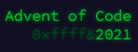

[](https://goreportcard.com/badge/github.com/meridani/advent-of-code-2021)
# Advent of Code 2021 in Go



🎄🎄🎄

You need to get your Advent of code session.
1. Login on the webpage
2. F12 - Network - Headers
3. copy the session=1234....ef into assets/.aocsession file without the session= part


## Running the days

```sh
    cd cmd/dayXX
    go run .
```

## Overview

| Day                                        | Name                    | Stars |
| ------------------------------------------ | ----------------------- | ----- |
| [01](https://adventofcode.com/2021/day/1)  | Sonar Sweep             | ⭐⭐    |
| [02](https://adventofcode.com/2021/day/2)  | Dive!                   | ⭐⭐    |
| [03](https://adventofcode.com/2021/day/3)  | Binary Diagnostic       | ⭐⭐    |
| [04](https://adventofcode.com/2021/day/4)  | Giant Squid             | ⭐⭐    |
| [05](https://adventofcode.com/2021/day/5)  | Hydrothermal Venture    | ⭐⭐    |
| [06](https://adventofcode.com/2021/day/6)  | Lanternfish             | ⭐⭐    |
| [07](https://adventofcode.com/2021/day/7)  | The Treachery of Whales | ⭐⭐    |
| [08](https://adventofcode.com/2021/day/8)  | Seven Segment Search    | ⭐⭐    |
| [09](https://adventofcode.com/2021/day/9)  | Smoke Basin             | ⭐⭐    |
| [10](https://adventofcode.com/2021/day/10) | Syntax Scoring          | ⭐⭐    |
| [11](https://adventofcode.com/2021/day/11) | Dumbo Octopus           | ⭐⭐    |
| [12](https://adventofcode.com/2021/day/12) | Passage Pathing         | ⭐⭐    |
| [13](https://adventofcode.com/2021/day/13) |                         |       |
| [14](https://adventofcode.com/2021/day/14) |                         |       |
| [15](https://adventofcode.com/2021/day/15) |                         |       |
| [16](https://adventofcode.com/2021/day/16) |                         |       |
| [17](https://adventofcode.com/2021/day/17) |                         |       |
| [18](https://adventofcode.com/2021/day/18) |                         |       |
| [19](https://adventofcode.com/2021/day/19) |                         |       |
| [20](https://adventofcode.com/2021/day/20) |                         |       |
| [21](https://adventofcode.com/2021/day/21) |                         |       |
| [22](https://adventofcode.com/2021/day/22) |                         |       |
| [23](https://adventofcode.com/2021/day/23) |                         |       |
| [24](https://adventofcode.com/2021/day/24) |                         |       |
